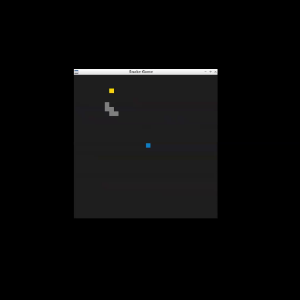

# CPPND: Capstone Snake Game Example

This is a starter repo for the Capstone project in the [Udacity C++ Nanodegree Program](https://www.udacity.com/course/c-plus-plus-nanodegree--nd213). The code for this repo was inspired by [this](https://codereview.stackexchange.com/questions/212296/snake-game-in-c-with-sdl) excellent StackOverflow post and set of responses.

The Capstone Project gives you a chance to integrate what you've learned throughout this program. This project will become an important part of your portfolio to share with current and future colleagues and employers.

In this project, you can build your own C++ application or extend this Snake game, following the principles you have learned throughout this Nanodegree Program. This project will demonstrate that you can independently create applications using a wide range of C++ features.

## Dependencies for Running Locally
* cmake >= 3.7
  * All OSes: [click here for installation instructions](https://cmake.org/install/)
* make >= 4.1 (Linux, Mac), 3.81 (Windows)
  * Linux: make is installed by default on most Linux distros
  * Mac: [install Xcode command line tools to get make](https://developer.apple.com/xcode/features/)
  * Windows: [Click here for installation instructions](http://gnuwin32.sourceforge.net/packages/make.htm)
* SDL2 >= 2.0
  * All installation instructions can be found [here](https://wiki.libsdl.org/Installation)
  >Note that for Linux, an `apt` or `apt-get` installation is preferred to building from source. 
* gcc/g++ >= 5.4
  * Linux: gcc / g++ is installed by default on most Linux distros
  * Mac: same deal as make - [install Xcode command line tools](https://developer.apple.com/xcode/features/)
  * Windows: recommend using [MinGW](http://www.mingw.org/)

## New Feature added
* Obstacle
  * A new Obstacle class has been added to introduce obstacles in the game.
  * The obstacles are randomly generated on the game grid and act as barriers that the snake must avoid.
  * If the snake's head collides with an obstacle, the snake dies, and the game is over.

* Game Restart:
  * After the snake dies (either by colliding with itself or an obstacle), you can press the spacebar to restart the game without needing to close and reopen the game.

* Bonus Food
  * Bonus Food has been added, which appears randomly on the grid with a pink color.
  * Bonus food only remains active for a limited time (now 8 seconds), after which it disappears if not eaten by the snake.
  * The probability of bonus food appearing is low, making it a special reward for the player. Eating the bonus food grants additional 5 points to the player.

## Basic Build Instructions

1. Clone this repo.
2. Make a build directory in the top level directory: `mkdir build && cd build`
3. Compile: `cmake .. && make`
4. Run it: `./SnakeGame`.

## Rubric Item Matched
### 1
### `Loops, Functions, I/O - The project accepts user input and processes the input`
> The project demonstrates an understanding of C++ functions and control structures.
In obstacle.cpp, i have several functions that manage obstacle generation, such as the constructor and other member functions like checkCollision() and generateConnectedRects(). 

> The project uses data structures and immutable variables.
In obstacle.cpp, i use vectors (e.g., std::vector<SDL_Rect> rects) to store the coordinates of each obstacle.Additionally, you may have constant variables (e.g., const std::size_t gridWidth) to define grid sizes or other settings that don't change throughout the game, ensuring immutability where necessary. 

### 2
### `Object Oriented Programming`
> One or more classes are added to the project with appropriate access specifiers for class members.
A new Obstacle class has been added to introduce obstacles in the game. (obstacle.cpp)

> Class constructors utilize member initialization lists.
Within obstacle.cpp (line 8)

> Classes abstract implementation details from their interfaces.

In Obstacle class, methods (line 14 and 59) such as checkCollision() and generateConnectedRects() hide the specific implementation details of obstacle generation and collision detection inside the class implementation. The caller only needs to call these methods through the public interface and doesn't need to be concerned with how they are implemented.

### 3
### `Memory Management`
> The project makes use of references in function declarations.
Within obstacle.cpp (line 59) of Snake and game.cpp (line 90) - In the new std::thread of `BonusFoodTimer()`

> The project uses move semantics to move data instead of copying it, where possible.
With game.cpp (line 15) to give ownership of the obstacle to Game.

> The project uses smart pointers instead of raw pointers.
Within game.h (line 38) and main.cpp (line 19) to creat smart pointer.

### 4
### `Concurrency`
> The project uses multithreading.
Multithreading is implemented by using a separate thread to manage the timing and existence of the Bonus Food. Specifically, the BonusFoodTimer() function runs in its own thread, which continuously monitors the lifespan of the bonus food. This thread ensures that the bonus food is removed after a certain time. Within game.cpp (line 90)

> A mutex or lock is used in the project.
These shared variables (`bonus_food` and `is_bonus_food_active`) are accessed by both the main game loop and the bonus food management thread, so it is critical to prevent data races and ensure consistent behavior. Within game.cpp (line 170)

## CC Attribution-ShareAlike 4.0 International

Shield: [![CC BY-SA 4.0][cc-by-sa-shield]][cc-by-sa]

This work is licensed under a
[Creative Commons Attribution-ShareAlike 4.0 International License][cc-by-sa].

[![CC BY-SA 4.0][cc-by-sa-image]][cc-by-sa]

[cc-by-sa]: http://creativecommons.org/licenses/by-sa/4.0/
[cc-by-sa-image]: https://licensebuttons.net/l/by-sa/4.0/88x31.png
[cc-by-sa-shield]: https://img.shields.io/badge/License-CC%20BY--SA%204.0-lightgrey.svg
